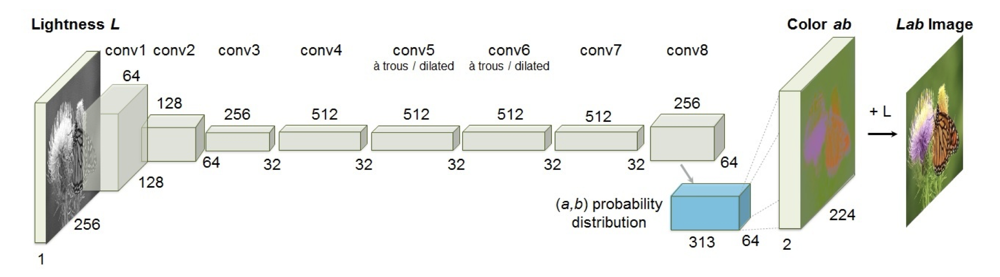

# Paddle-Colorization

_Use PaddlePaddle to implementate Colorful Image Colorization_

**Paper:** [Colorful Image Colorization](https://arxiv.org/pdf/1603.08511.pdf)

**Competition Page:** [PaddlePaddle AI Studio](https://aistudio.baidu.com/aistudio/competition/detail/106)

**Architecture:**


**Other Version Implementation:**

- [PyTorch](https://github.com/richzhang/colorization)

## Usage

### Download PaddlePaddle Weight

Download weight from [Google Drive](https://drive.google.com/drive/folders/1hRUbrlUkO5zXzi_6h2ntA6zR_1Uw2xUq?usp=sharing), and place it under `modle/pretrain/`.

Or you can place it anywhere you want and change the weight path in `colorizers/eccv16.py` and `colorizers/siggraph17.py`.

### Run

Training script:

```
python train.py -bs 40 --use_gpu  
```

Evaluation script:

```
python train.py --use_gpu -e 0 --pretrain
```
 Please check main branch for inference